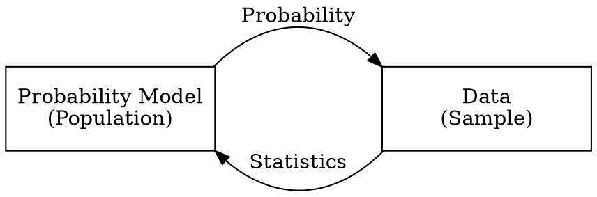

# Probability and Statistics

> 「機率統計」貌似是一個很常被結合再一起用的東西，但「機率」與「統計」又通常是兩門不同的學科，而其中的差異到底在什麼地方，又有什麼相似的地方呢。

## 機率與統計的關係

上圖表示出了機率與統計的關係，可以看出其實這兩個學科是兩個主體--機率模型 (Probability Model) 與抽樣結果 (Sampled Data)--之間的兩個方向的關係。

- 機率：透過機率模型模擬一資料母體當中資料的分配方式，以推測樣本資料出現的現象。
- 統計：從資料母體當中抽取樣本資料後從樣本資料推測資料母體的機率模型。

:::info
**模型 (Model) 是什麼?**
模型是一個對於未知的現象利用手邊可得到或者進行的方式對該現象的推理。例如：牛頓運動定律是對於巨觀世界物體之間的交互作用關係進行推理的結果。

其中，關於模型有一句很重要的話。

> All models are wrong, but some are useful
> [name=George E. P. Box (British Statistician)][time=1979]

就如同量子物理證實在極小 (原子) 的尺度當中牛頓力學不適用，因此牛頓力學勢必不會是世界運行的真理，但在人類日常生活可及的程度當中他的實用性極高。
因此，對於任何一個研究結果，皆要確認兩個重要的問題。

- How wrong is your model?
- And how useful is it?

對於每一個研究的結果，其限制與應用範圍應該要是一個研究員最需要關注的地方，這也代表了一個研究結果對於世界的貢獻程度。

> 其實自然科學就是渺小的人類對於世界的運作不斷的探究「真理」的過程。
> > 有沒有真理之門呢(X)
:::

## 名詞定義

在統計當中有一些專有名詞要特別定義一下。

- 實驗 (Experiment): 一個取得觀測值 (observation or measurement) 的過程。例如：問卷調查、骰骰子、彈硬幣、選擇大樂透號碼。
- 結果 (Outcome): 在重複性的實驗 (Experiment) 當中，其中一次的觀察結果。通常是應用機率的最小單元。通常會以 $O$ 配合下標作為表示。
    例如：一次大樂透開獎結果(六個號碼+一個特別號)、骰一次骰子的點數。
- 結果空間 (Outcome Space): 所有可能出現的結果 (Outcome) 所成的集合。通常以 $S$ 配合下標作為表示。
    例如：骰一顆骰子的結果空間為 $\{1,2,3,4,5,6\}$、血型檢測的結果空間為 $\{\text{A}, \text{B}, \text{AB}, \text{O}\}$。
- 事件 (Event): 結果 (outcome) 所成的集合，應為結果空間 (outcome space) 的子集合。通常以條件表示。
    例如：骰子點數為偶數的結果、大樂透一般號碼皆大於 30 的結果集合。

> 以上需要特別注意的部分是結果 (outcome) 的部分，其不限制一定需為單一一個數字，亦可為一組數字或其他可能。

### 事件關係

由於「事件」通常為探討機率的常見單元，因此各個不同事件的關係也很重要。
由於事件在數學上是以集合表示，兩個集合間的關係皆可應用在事件上。

- 補集 (Complement): 在結果空間當中不符合事件 $A$ 的結果所成的集合稱為 $A$ 的補集。通常以 $A^C$ 或者 $A'$ 表記。
- 交集 (Intersection): 同時滿足兩個事件 $A, B$ 的結果所成的集合稱為 $A, B$ 的交集。以 $A \cap B$ 表記。
- 聯集 (Union): 滿足兩事件 $A, B$ 中至少一個的結果所成的集合稱為 $A, B$ 的聯集。以 $A \cup B$ 表記。

## 排列組合

再計算結果空間大小 (可能出現的結果數量) 時，時常需要用到排列組合的相關觀念，以下簡單複習排列組合常見的技巧。

### 排列 (Permutation)

將 $n$ 個相異物**依序**排列進入 $r$ 個位置 ($n \ge r$) 時，有幾種可能性。

$$
\begin{array}{|l|c|c|c|c|}
\text{Position} & 1 & 2 & \cdots & r \\ \hline
\text{Choice} & n & n - 1 & \cdots & n - r + 1
\end{array}
$$
